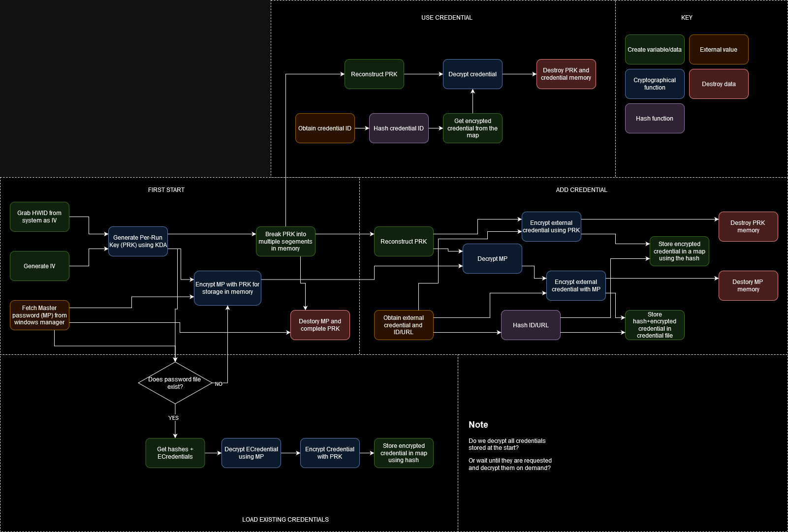

# C++ Credential Manager
Current scope: Windows only
### Plan
* Generate large One-Time-Key (OTK) on start
* Break OTK into multiple smaller parts
* fetch master password from windows credential manager
* Encrypt and hold master password in memory using OTK
* Ingest credentials and an identifier (Service or URL)
* encrypt credentials using OTK and store in a encrypted file using a master password to encrypt
* encrypted credentials will also be stored in a map using a hash of their identifier

### Storing credentials in memory
As storing credentials in memory can potentially leaked by side channel attacks, we will encrypt this data while in memory
When required, the credentials can be decrypted using the OTK, used, and then re-encrypted 
Memory to store the clear-text credentials needs to be secure cleared once the credential has been used

### Useful windows functions
*  bcrypt.h
    * DeriveKeyPBKDF2 - Generate key from secret
    * Encrypt - encrypt a block of data
    * Decrypt - decrypt a block of data
    * Hash - generate a hash of data
    * GenRandom - generate a random value
* GetCurrentHwProfile - get local hardware ID

## Diagram
